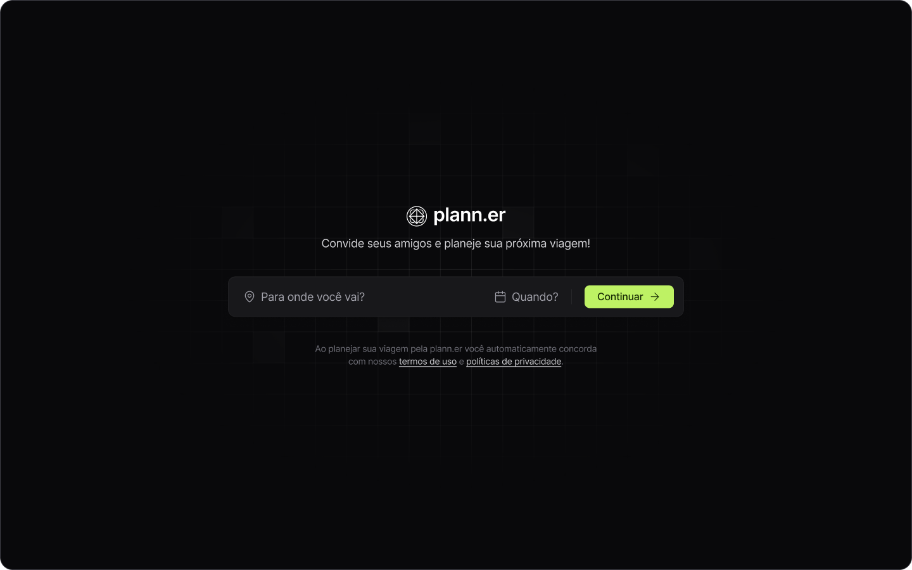
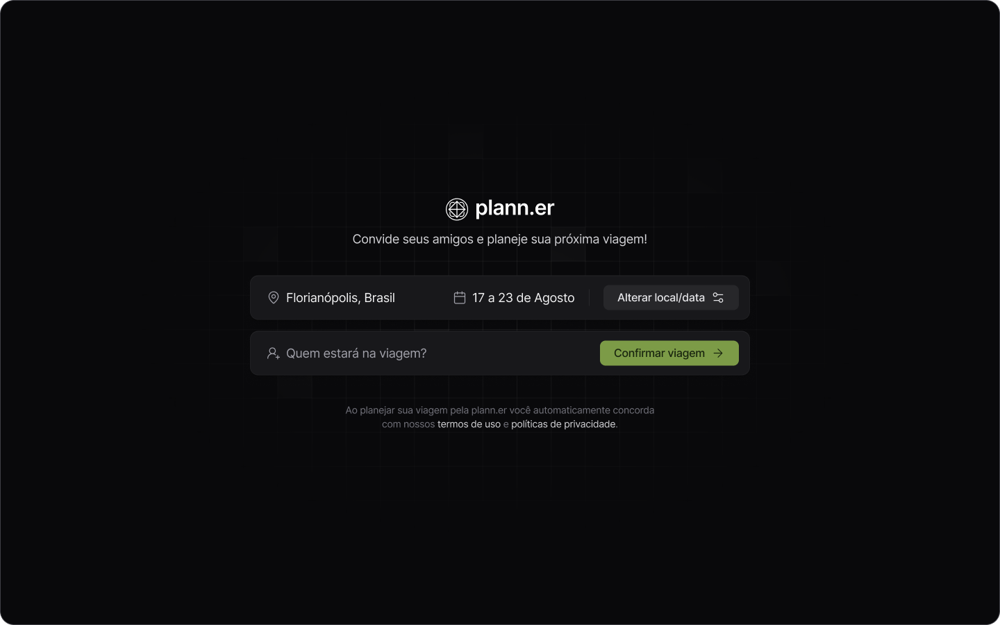
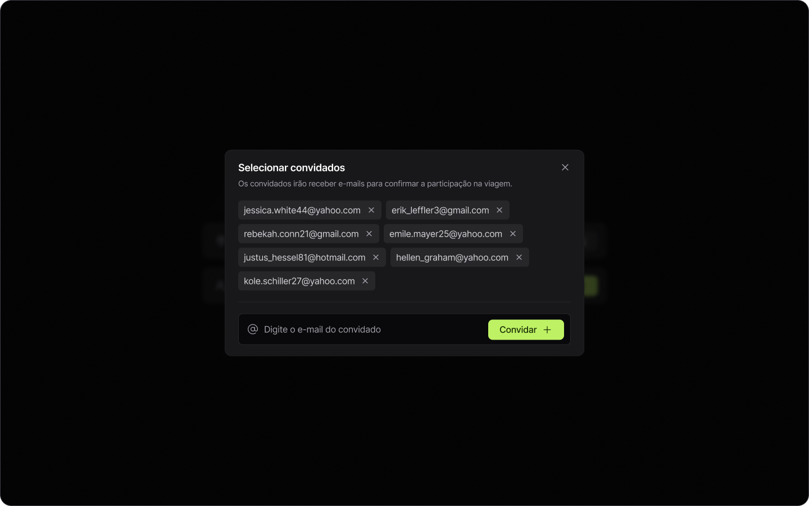
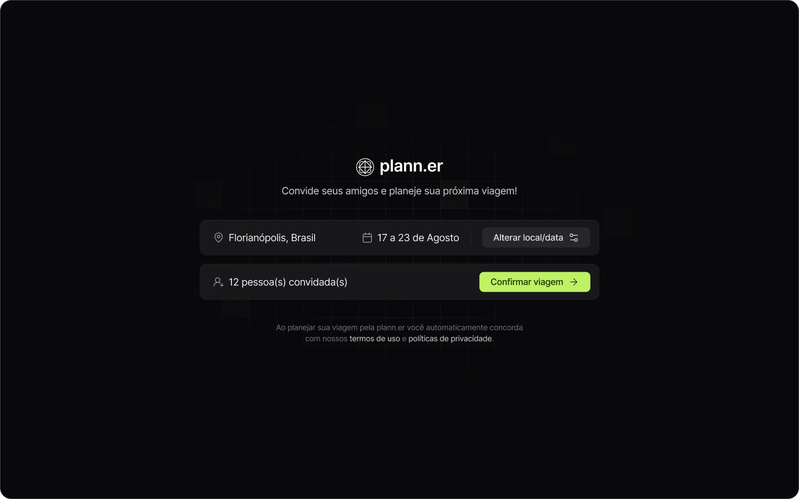
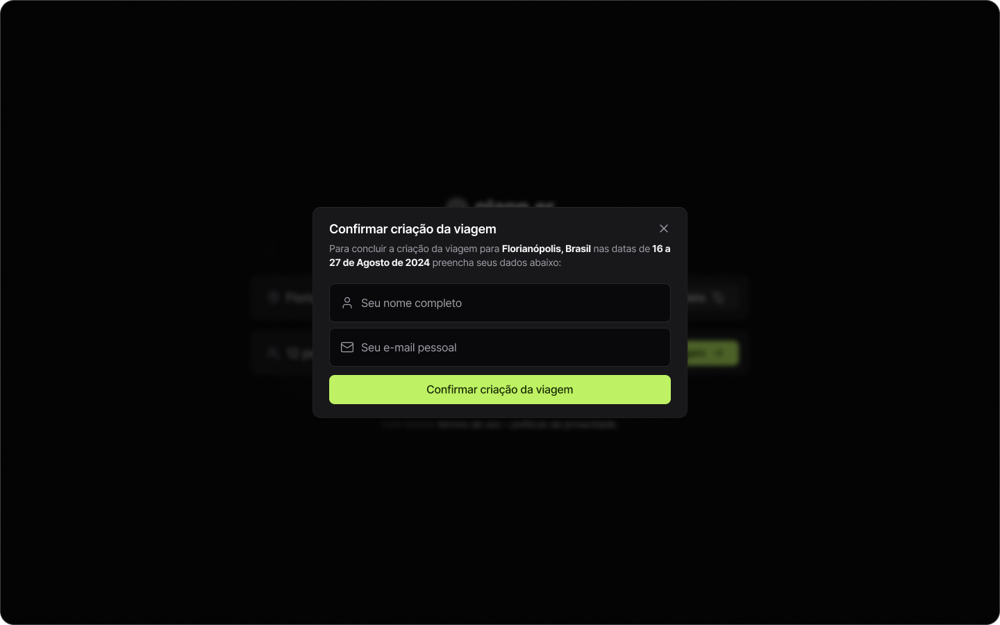
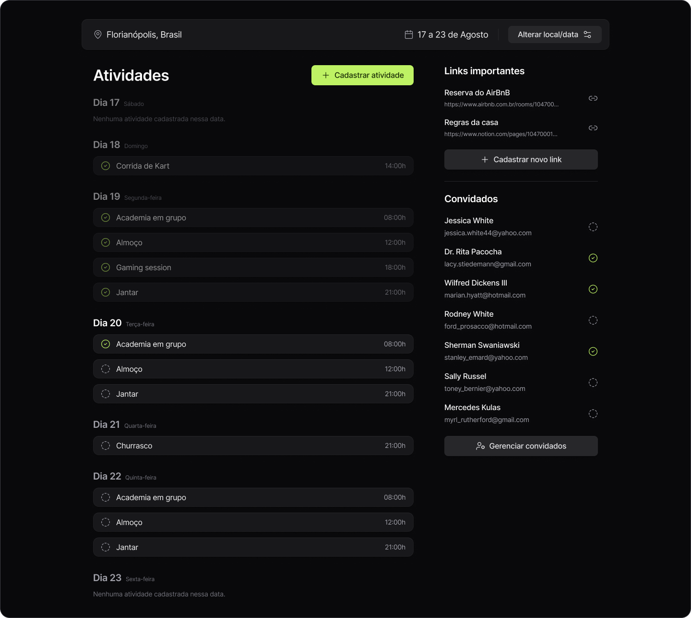
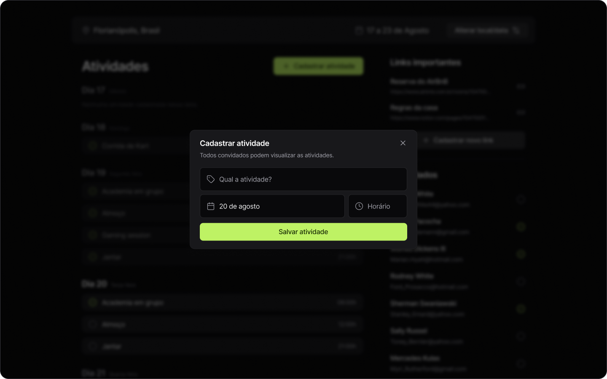
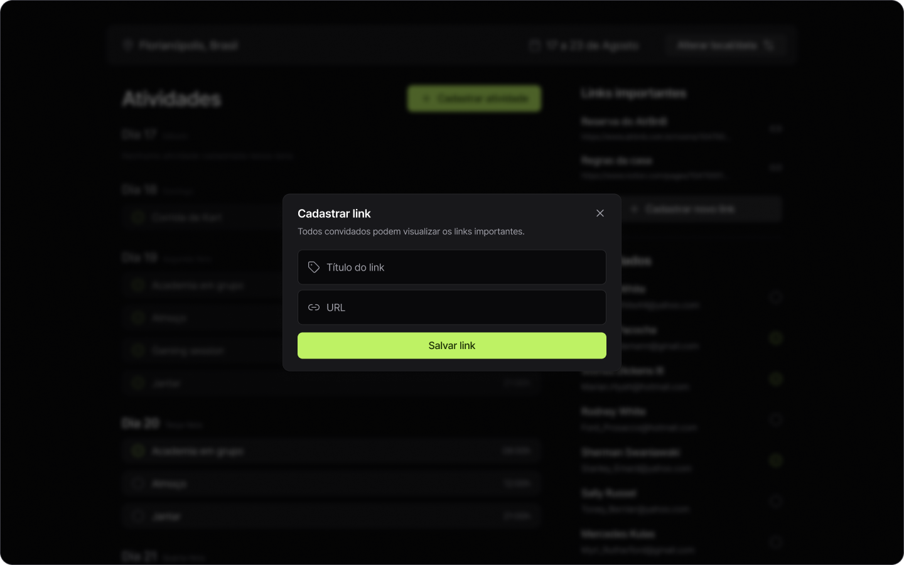
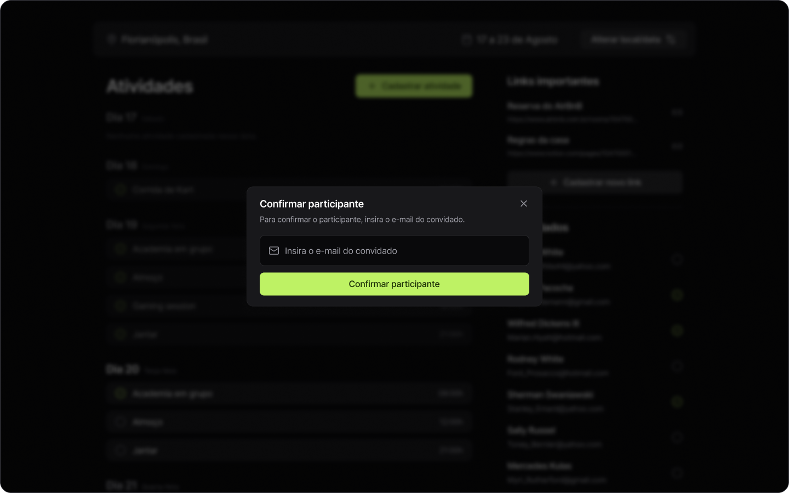

<h1 align="center">
  
  NLW Journey (ReactJs)
</h1>

<p align="center">
  

  

  
  
  <a href="https://github.com/bielwdev/nlw-journey-reactjs/commits/main">
    
  </a>

</p>

<p>
  
</p>

<h4 align="center"> 
	🚀 Aplicação finalizada 🚀
</h4>

<p align="center">
 <a href="#-about">About</a> |
 <a href="#-layout">Layout</a> |
 <a href="#-setup">Setup</a> |
 <a href="#-technologies">Technologies</a> |
</p>


## 💻 About

Esta aplicação de nome **Plann.er** consiste em um site desktop para montar planos de viagem com amigos, registrar atividades e links úteis.

Os principais aprendizados neste projeto são a separação e componentização da interface em pequenas partes que podem ser reutilizadas, desta forma, facilitando também a manutenção futura. Ademais, também teve-se a implementação de roteamento com `React Route DOM` para a apresentação das rotas/paginas da aplicação de maneira dinâmica. Contudo, também vale destacar implementação de uma interface totalmente padronizada com princípios de um bom design usando o `Tailwind`.

Todavia, essa aplicação foi desenvolvida durante o NLW Journey da [Rocketseat](https://www.rocketseat.com.br/) utilizando principalmente tecnologias como `React`, `TypeScript` e `Tailwind`.


<!-- ## 🔗 Deploy

O deploy da aplicação pode ser acessada através da seguinte URL base: -->


## 🎨 Layout

Você pode visualizar o layout do projeto através [desse link](https://www.figma.com/design/IJrdmzFVgY9ohbWKqlPxMA/NLW-Journey-%E2%80%A2-Planejador-de-viagem-(Community)?node-id=3-376&node-type=CANVAS). É necessário ter conta no [Figma](https://www.figma.com/) para acessá-lo.

A seguir, veja uma demonstração das principais telas da aplicação:

### Nova Viagem (Local e Data)

<p align="center">
  
</p>

### Nova Viagem (Pessoas)

<p align="center">
  
</p>

### Nova Viagem (Convidar)

<p align="center">
  
</p>

### Nova Viagem (Finalizar)

<p align="center">
  
</p>

### Nova Viagem (Confirmar)

<p align="center">
  
</p>

### Detalhes da Viagem (Full Page)

<p align="center">
  
</p>

### Detalhes da Viagem (Nova Atividade)

<p align="center">
  
</p>

### Detalhes da Viagem (Novo Link)

<p align="center">
  
</p>

### Detalhes da Viagem (Confirmar Participante)

<p align="center">
  
</p>

## ⚙ Setup

### 📝 Requisites

Antes de baixar o projeto você vai precisar ter instalado na sua máquina as seguintes ferramentas:

* [Git](https://git-scm.com)
* [NodeJS](https://nodejs.org/en/)
* [NPM](https://www.npmjs.com/) ou [Yarn](https://yarnpkg.com/)
* Para reproduzir o acesso a API back-end com os dados necessários para o front-end, clone o seguinte [repositório](https://github.com/rocketseat-education/nlw-journey-nodejs) que contem a API do nosso back-end feita em Node.js e execute na sua máquina.

Além disto é bom ter um editor para trabalhar com o código como [VSCode](https://code.visualstudio.com/)

### Cloning and Running

Passo a passo para clonar e executar a aplicação na sua máquina:

```bash
# Clone este repositório
$ git clone https://github.com/bielwdev/nlw-journey-reactjs.git

# Acesse a pasta do projeto no terminal
$ cd nlw-journey-reactjs

# Instale as dependências
$ npm install

# Execute a API back-end

# Execute a aplicação em modo de desenvolvimento
$ npm run dev

# A aplicação inciará em alguma porta disponível que poderá ser acessada pelo navegador
```

## 🛠 Technologies

As seguintes principais ferramentas foram usadas na construção do projeto:

- **[React + Vite](https://vitejs.dev/)**
- **[TypeScript](https://www.typescriptlang.org/)**
- **[TailwindCSS](https://tailwindcss.com/)**
- **[TailwindCSS Variants](https://www.tailwind-variants.org/)**
- **[React Router DOM](https://reactrouter.com/)**
- **[React Query](https://tanstack.com/query/latest)**
- **[Lucide Icons](https://lucide.dev/icons/)**
- **[React Day Picker](https://daypicker.dev/)**
- **[date-fns](https://date-fns.org/)**
- **[Axios](https://axios-http.com/ptbr/docs/intro)**

> Para mais detalhes das dependências gerais da aplicação veja o arquivo [package.json](./package.json)


##
<p align="center">
  README.md structure by: <a href="https://github.com/PabloXT14">@pabloxt14 </a> 
</p>